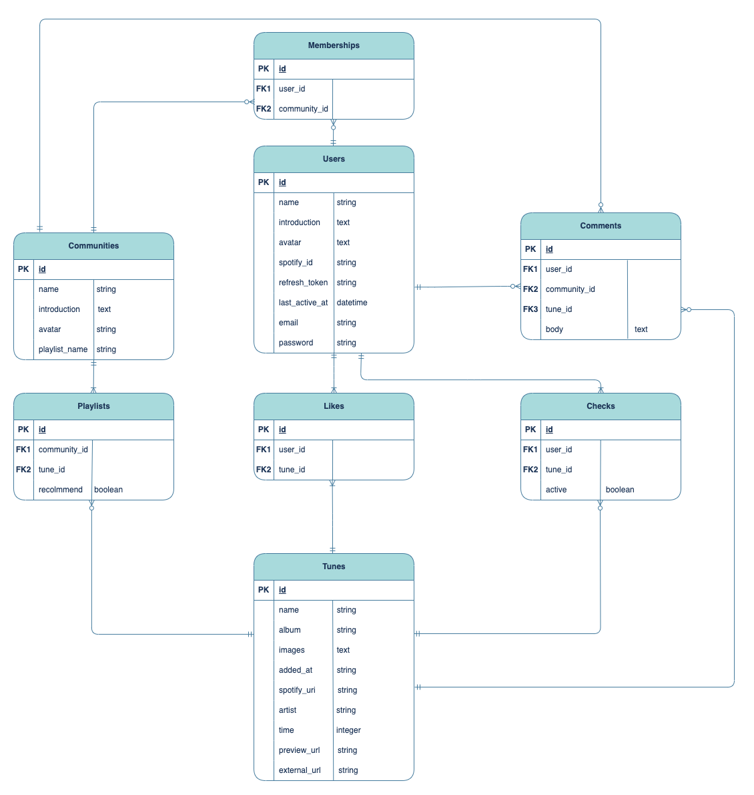

# Mixtones

Mixtones は Spotify ユーザー同士がサービス内でコミュニティを作成し、自動で「お気に入りの楽曲」リストを共有できる web サービスです。

Spotify を利用していないユーザーも登録することができ、サービス内で発見した楽曲を再生、保存したりなど様々なアクションを行うことができます。

▼**サービス URL**

[https://web.mixtones.tech/](https://web.mixtones.tech/)

▼**開発者Twitter**

[Twitter](https://twitter.com/saito_engine)

日々の開発記録や学習内容を簡単ではありますがまとめています。何かあれば、こちらまでお気軽にご連絡ください。

---

## 主な使用技術

### フロントエンド

- [JavaScript](https://developer.mozilla.org/ja/docs/Web/JavaScript)
- [React](https://ja.reactjs.org/)
- [TailwindCSS](https://tailwindcss.com/)

※フロント側は husky&lint-staged を用いて pre-commit 時に ESLint、Prettier を実行してコードの品質を保っています

### バックエンド

- [Ruby on Rails](https://rubyonrails.org/)

### インフラ

#### DB

- [MySQL](https://www.mysql.com/)

#### AWS

- [ECR](https://aws.amazon.com/ecr/)
- [ECS](https://aws.amazon.com/ecs/)
- [EC2](https://aws.amazon.com/ec2/)
- [Fargate](https://aws.amazon.com/fargate/)
- [IAM](https://aws.amazon.com/iam/)
- [ElastiCache](https://aws.amazon.com/elasticache/)
- [S3](https://aws.amazon.com/s3/)
- [CloudFront](https://aws.amazon.com/cloudfront/)
- [Route 53](https://aws.amazon.com/route53/)
- [RDS](https://aws.amazon.com/rds/)

### 環境構築

- [Docker](https://www.docker.com/)
- [Vite](https://vitejs.dev/)

### テストフレームワーク

- [RSpec](https://rspec.info/)

### 外部サービス

- [Spotify API](https://developer.spotify.com/documentation/web-api/)

## 主要機能一覧

### ユーザー向け

#### 機能

- Spotify API と連携したユーザー登録 / ログイン機能
- 主要機能テストのためのゲストログイン機能
- ユーザー情報変更機能
- 画像のアップロード機能
- 退会機能
- コミュニティ作成・加入・脱退・情報変更機能
- ユーザー同士の「お気に入りの曲」プレイリストを統合したコミュニティプレイリストの自動作成機能
- Spotify アプリ上のアクティビティに合わせた上記プレイリストの自動更新機能
- 発見した楽曲をプロフィールページに保存できるチェック機能
- ユーザー環境に合わせた楽曲の再生機能
  - PC: [Spotify Web Playback SDK](https://developer.spotify.com/documentation/web-playback-sdk)
  - モバイル: [Spotify app](https://apps.apple.com/us/app/spotify-music-and-podcasts/id32468458)
  - 非 Spotify ユーザー: プレビュー再生

#### 画面

- ローディング画面
- モーダル画面(各画面の詳細は[下記](https://www.figma.com/design/DIyTcv7AaRL7N2ieR4kPDa/Mixify_%E7%94%BB%E9%9D%A2%E9%81%B7%E7%A7%BB%E5%9B%B3?node-id=0-1&t=fIeI1VKmoVXSV93N-0)の画面遷移図参照)
- レスポンシブデザイン

### 非ユーザー向け

#### システム / インフラ

- Dockerによる開発環境のコンテナ化
- Route53による独自ドメイン + TLS化
  - バックエンド
    - CI: Rubocop / RSpec
    - CD: AWS ECS
  - フロントエンド
    - CI: ESLint / Prettier

## ER図

## 画面遷移図・コンポーネント設計

[Figma](https://www.figma.com/design/DIyTcv7AaRL7N2ieR4kPDa/Mixify_%E7%94%BB%E9%9D%A2%E9%81%B7%E7%A7%BB%E5%9B%B3?node-id=0-1&t=fIeI1VKmoVXSV93N-0)